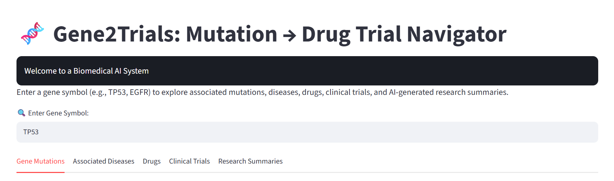
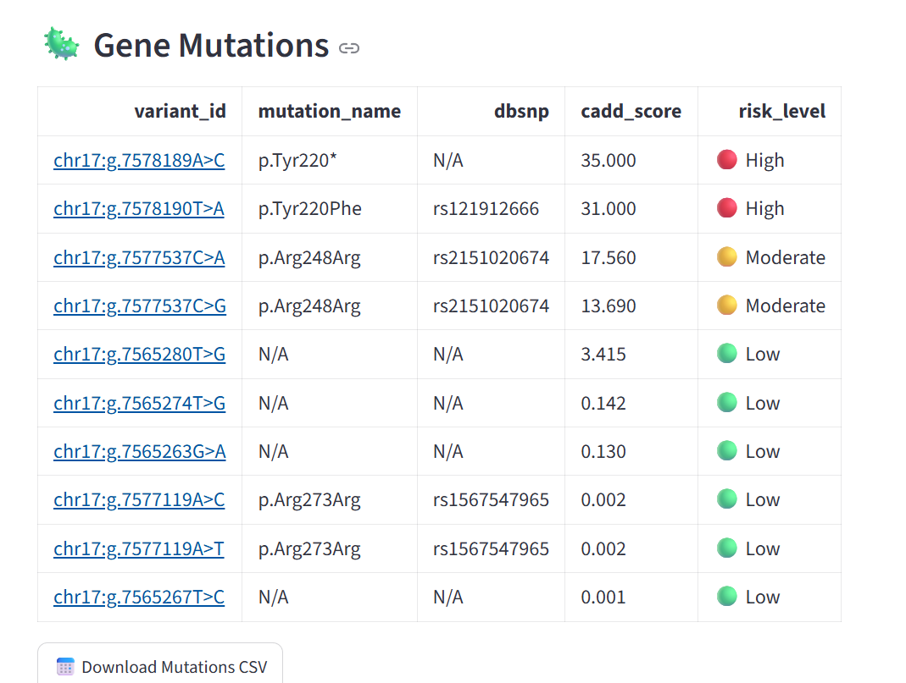
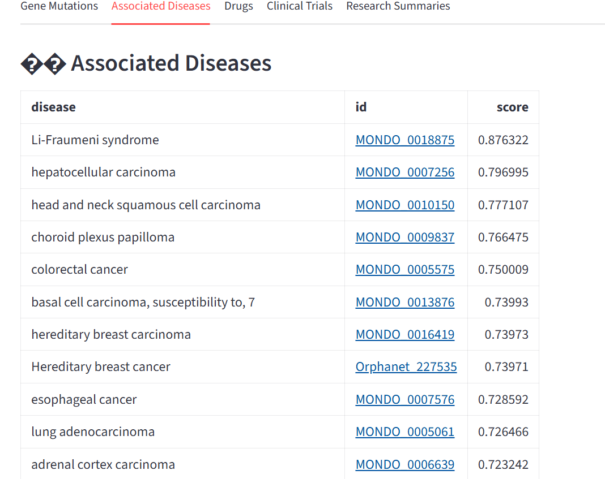
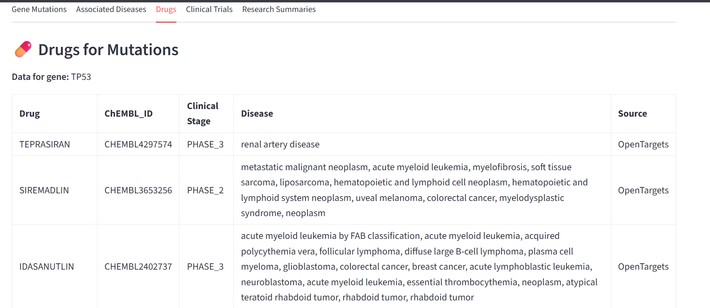
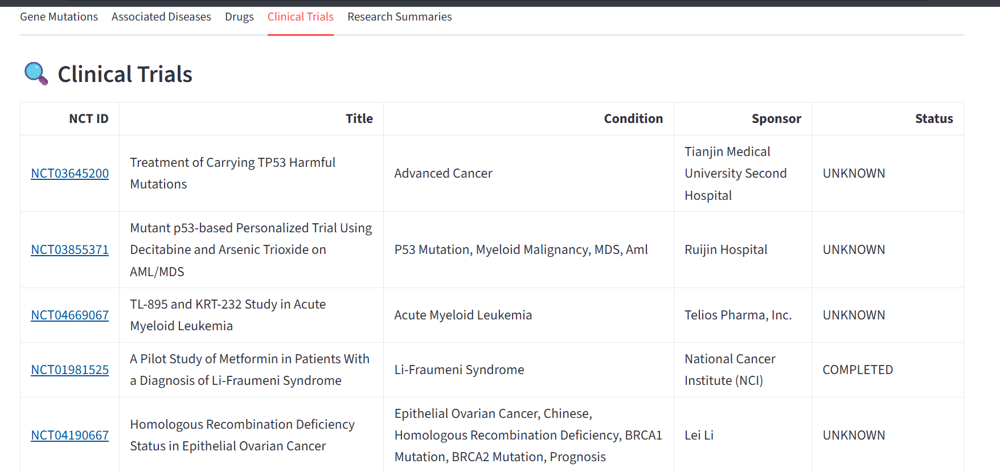
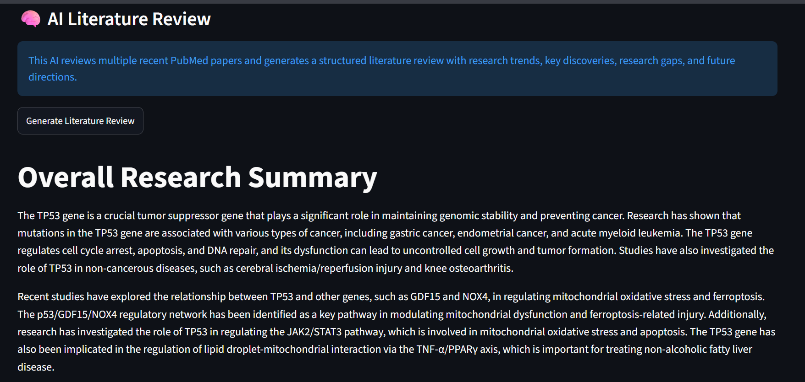

# 🧬 Gene2Trials Navigator

### Gene → Mutations → Disease → Drug → Clinical Trial Discovery Platform → AI powered Literature Summary

<p align="center">
  
  
  
</p>

---

## 📌 Overview

**Gene2Trials Navigator** is an AI-powered bioinformatics platform designed to bridge the gap between genomic information and therapeutic discovery.

Given a single gene of interest, the platform integrates multiple biomedical databases to identify:

- 🧬 Gene Mutations
- 🦠 Associated diseases
- 💊 Potential drug candidates
- 🧪 Clinical trial evidence
- 📚 Supporting biomedical literature

The goal is to accelerate early-stage drug discovery and biomedical research by providing a **unified, single-search, gene-to-therapy exploration workflow**.

---

## 🔬 Core Concept

```
Gene
  ↓
Gene Mutations
  ↓
Disease Association
  ↓
Drug Candidates
  ↓
Clinical Trials
  ↓
Scientific Literature
  ↓
AI-Assisted Interpretation
```

## ✨ Key Features

### 🧬 1. Gene Identification

Accepts a gene symbol (e.g. `TP53`), converts it into an Ensembl identifier, and retrieves biological target information.

**Powered by:** OpenTargets Platform



---

### 🧬 2. Gene Mutation Information

Provides mutation-level details for the selected gene, including known variants, mutation types, and their clinical/functional significance.



---

### 🦠 3. Disease Association Analysis

Identifies diseases associated with the selected gene, along with disease identifiers and association evidence scores.

**Example — TP53:**

```
TP53
 → Breast Cancer
 → Acute Myeloid Leukemia
 → Glioblastoma
 → Other cancer-related diseases
```



---

### 💊 4. Drug Discovery Module

Retrieves therapeutic candidates linked to the gene via biomedical databases.

```
Gene
 ↓
OpenTargets Drug Associations
 ↓
Drug Candidates
 ↓
Clinical Development Stage
```

#### 📊 Drug Discovery Dashboard



---

### 🧪 5. Clinical Trial Integration

Integrates clinical trial information, including trial identifiers, study phases, trial status, and therapeutic evidence.

**Source:** ClinicalTrials.gov API



---

### 🤖 6. AI-Assisted Biomedical Interpretation 

AI research summaries include:

- Biomedical NLP
- Literature summarization
- Research evidence explanation



---

## 🛠️ Technology Stack

**Programming:** Python

**Bioinformatics:** Computational Biology · Genomics · Drug Discovery · Biomedical Data Analysis

**APIs & Databases**

| Database | Purpose |
|---|---|
| OpenTargets | Gene–Disease–Drug associations |
| ChEMBL | Drug information |
| ClinicalTrials.gov | Clinical trial evidence |
| PubMed | Biomedical literature |

**Machine Learning / AI:** NLP · Large Language Models · Biomedical Information Retrieval

**Application Development:** Streamlit · FastAPI · Pandas · Requests

---

## 📂 Project Structure

```text
Gene2Trials/
│
├── app.py
├── requirements.txt
├── README.md
│
├── images/
│   ├── hero_banner.png
│   ├── architecture.jpg
│   ├── workflow.jpg
│   ├── gene_tab.png
|   ├── mutations.png
│   ├── disease.png
│   ├── drugs.png
│   ├── trials.png
│   └── ai_summary.png
│
└── utils/
    ├── mutations.py
    ├── drugs.py
    ├── diseases.py
    ├── trials.py
    └── literature.py
```

---

## 🚀 Installation

```bash
# Clone the repository
git clone https://github.com/Bano733-code/Gene2Trials.git

# Navigate into the project
cd Gene2Trials

# Install dependencies
pip install -r requirements.txt

# Run the application
streamlit run app.py
```

---

## 📡 Data Sources

- OpenTargets Platform
- ChEMBL Database
- ClinicalTrials.gov
- PubMed

---

## 🔮 Future Improvements

- AI-based drug ranking system
- Drug repurposing prediction
- Multi-omics integration
- Protein structure-based analysis
- Personalized medicine insights

---

## 👩‍💻 Author

**Bano Rani**
Bioinformatics Student

**Research Interests:** AI for Drug Discovery · Computational Biology · Genomics · Precision Medicine

---

## ⭐ Acknowledgements

This project builds upon open biomedical databases and computational biology resources that enable data-driven therapeutic discovery.

---

## 📜 License

This project is intended for academic and research purposes.
